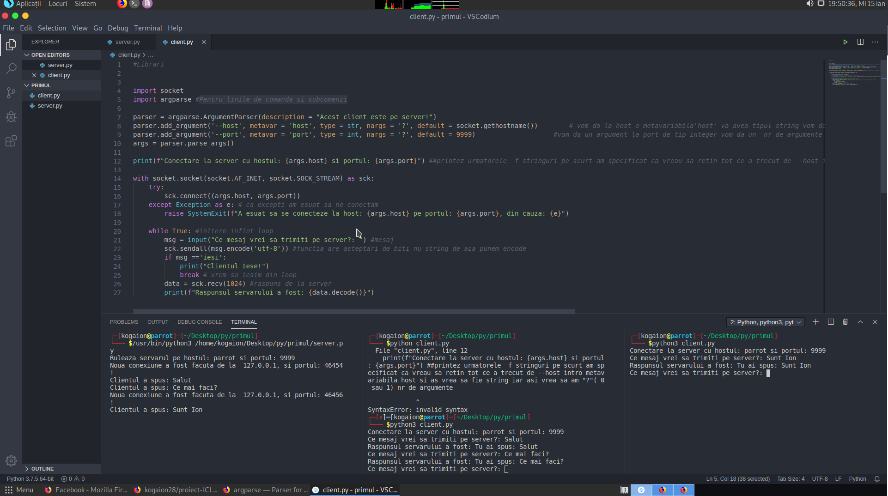

# Jude Bogdan Laurentiu-aplicatie--> mesaje-server-client
Aplicatie pentru chat in Python(care contine si thread-uri)

Autor: Jude Bogdan Laurentiu UAB

Aplicatia poate avea un numar mare de clienti care sa comunice pe acelasi server.

Tehnologia folosite este Python 

Aplicatia poate fi rulata pe windows (folosind cmd si avand instalat python) si linux (folosind terminalul) 
Rularea programului se face prin executatrea  serverului ($python3 server.py) si dupa a clientuli(python3 client.py)

Bibliografie:
https://www.python.org/doc/ --->> pt. biblioteci si functii

